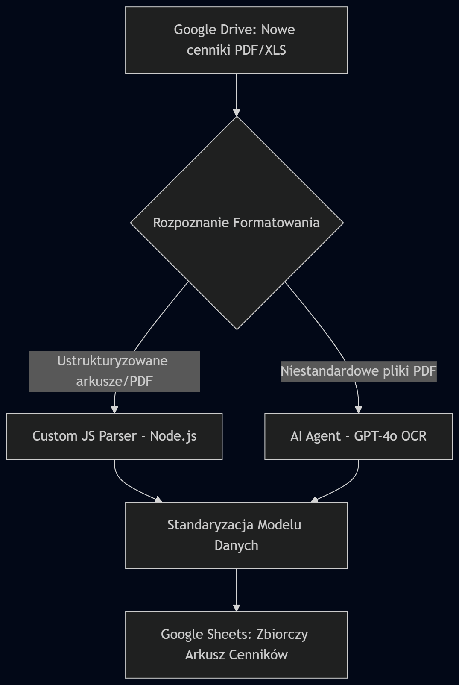

# ⚡ Automatyzacja Analizy i Przetwarzania Cenników Energii Elektrycznej

Kompleksowy system automatyzacji procesów (BPA) stworzony w środowisku **n8n**, służący do automatycznego pobierania, strukturyzacji oraz agregacji danych o cennikach energii elektrycznej pochodzących od kluczowych dystrybutorów i sprzedawców rynkowych.

> **Uwaga dotycząca prywatności i ochrony danych (Data Privacy & Confidentiality):** 
> Ze względu na politykę poufności oraz ochronę tajemnicy przedsiębiorstwa (klucze API, struktura folderów, identyfikatory dokumentów oraz bezpośrednie nazwy podmiotów rynkowych), surowy kod eksportu JSON został zastąpiony powyższym diagramem architektury oraz opisem logicznym wdrożenia.

---

## 💡 Problem Biznesowy
* **Brak standaryzacji:** Różni dostawcy rynkowi publikują cenniki w wysoce odmiennych formatach (wielostronicowe pliki PDF, arkusze XLS, nieregularne tabele, odmienne nazewnictwo stref cenowych).
* **Czasochłonność:** Ręczne pobieranie, weryfikacja i przepisywanie stawek zajmowało zespołowi analitycznemu wiele godzin tygodniowo.
* **Ryzyko błędów:** Ręczna manipulacja dużymi zbiorami danych liczbowych generowała ryzyko pomyłek w ofertach i kalkulacjach dla klientów.

---

## 🛠️ Architektura i Wdrożone Rozwiązanie

Proces działa w oparciu o architekturę zdarzeniową (Event-driven):

1. **Automatyczny Trigger & Ingestion:**
   * System monitoruje przestrzeń Google Drive pod kątem pojawienia się nowych cenników od dostawców.
2. **Hybrydowa Ekstrakcja Danych:**
   * **Custom JavaScript (Node.js):** Zaawansowana ekstrakcja i wyciąganie ustrukturyzowanych tabel dla dokumentów o przewidywalnym formacie.
   * **AI Agent (GPT-4o OCR):** Wykorzystanie modelu LLM podłączonego przez API do analizy skomplikowanych i niestandardowych plików PDF (precyzyjne mapowanie stawek dla konkretnych stref energetycznych).
3. **Standaryzacja i Zapis:**
   * Ujednolicenie danych od wszystkich dostawców do jednego, spójnego modelu danych i automatyczne zasilenie zbiorczego arkusza w **Google Sheets**.

---

## ⚙️ Tech Stack
* **Orkiestracja:** n8n
* **Sztuczna Inteligencja / LLM:** OpenAI GPT-4o (AI Agent / OCR / Structured Outputs)
* **Przetwarzanie Danych:** JavaScript (Node.js)
* **Integracje:** Google Drive API, Google Sheets API

---

## 🎯 Efekty Biznesowe
* **~90% redukcji czasu** przetwarzania dokumentów rynkowych.
* **100% eliminacji błędów ludzkich** przy przepisywaniu stawek.
* **Skrócenie czasu przygotowania oferty** dzięki natychmiastowej dostępności ujednoliconych danych w Google Sheets.
